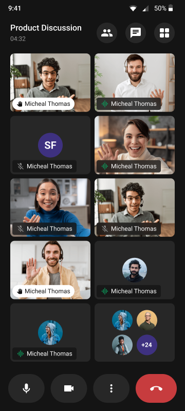

<p align="center">
  
</p>

# CometChat JavaScript Calls SDK

The CometChat Calls SDK enables real-time voice and video calling capabilities in your web application. Built on top of WebRTC, it provides a complete calling solution with built-in UI components and extensive customization options.

<p align="center">
  
</p>

<p align="center">
  &nbsp;&nbsp;
  &nbsp;&nbsp;
  
</p>

---

## Getting Started

To set up the CometChat Calls SDK and utilize CometChat for your calling functionality, you'll need to follow these steps:

1. Registration: Go to the [CometChat Dashboard](https://app.cometchat.com/) and sign up for an account.
2. After registering, log into your CometChat account and create a new app. Once created, CometChat will generate an Auth Key and App ID for you. Keep these credentials secure as you'll need them later.
3. Check the [Key Concepts](https://www.cometchat.com/docs/fundamentals/key-concepts) to understand the basic components of CometChat.

## 📦 Installation

```bash
npm install @cometchat/calls-sdk-javascript
```

For the complete setup guide, refer to our [official documentation](https://www.cometchat.com/docs/sdk/javascript/overview).

## 🚀 Explore the Sample Apps

Dive straight into our sample apps to see the CometChat Calls SDK in action.

- [React Sample App](sample-apps/cometchat-calls-sample-app-react#readme)
- [Angular Sample App](sample-apps/cometchat-calls-sample-app-angular#readme)
- [Vue Sample App](sample-apps/cometchat-calls-sample-app-vue#readme)
- [Svelte Sample App](sample-apps/cometchat-calls-sample-app-svelte#readme)
- [Ionic Sample App](sample-apps/cometchat-calls-sample-app-ionic#readme)

---

## Help and Support

For issues running the project or integrating with our UI Kits, consult our [documentation](https://www.cometchat.com/docs/sdk/javascript/overview) or create a [support ticket](https://help.cometchat.com/hc/en-us) or seek real-time support via the [CometChat Dashboard](https://app.cometchat.com/).
